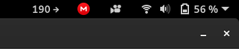

# Dexcom Tray
Do you have a Dexcom (G4, G5 or G6) CGM System and want to display your current glucose level in Gnome's top tray bar? Then you came to the right place!

<p align="center">
    
</p>

With the help of the [Argos plugin](https://github.com/p-e-w/argos) for Gnome, the setup is surprisingly easy. Argos is a Gnome extension that turns the standard output of executables into tray icons with a dropdown menu. An equivalent for Mac would be [xbar](https://github.com/matryer/xbar) which should analogously for the given use-case.

## Setup
To set up the tray icon, simply install [Argos for Gnome](https://extensions.gnome.org/extension/1176/argos/) and navigate to `~/.config/argos`.

You will find an example file named `argos.sh` which displays an example menu in the tray bar. To deactive, simply hide the file by renaming it to `.argos.sh`.

Now, we can set up the tray icon. For this, we use Python and the [pydexcom](https://github.com/gagebenne/pydexcom) package which allows for easy access to the Dexcom Share API. Note that you need to activate the Share function in the Dexcom app first and add at least one follower. If basic access to the Dexcom Share API works, create a python file named `glucose_runner.5m.py` in the Argos config folder. `glucose_runner` is the name of the component which can be changed arbitrarily and the `5m` part states that the file is rerun every five minutes.

With the most minimal configuration, the `glucose_runner.5m.py` Python file can look as follows: 

```python
from pydexcom import Dexcom

# set ous to True if outside the US, otherwise False
dexcom = Dexcom("username/email", "password", ous = True)

# read and display the blood sugar value and trend arrow
bg = dexcom.get_current_glucose_reading()
print(f'{bg.value} {bg.trend_arrow}')
```

Make sure to enter the correct username and password of your default Dexcom user (not the follower). When the file is saved, the output should immediately appear in the top tray bar.